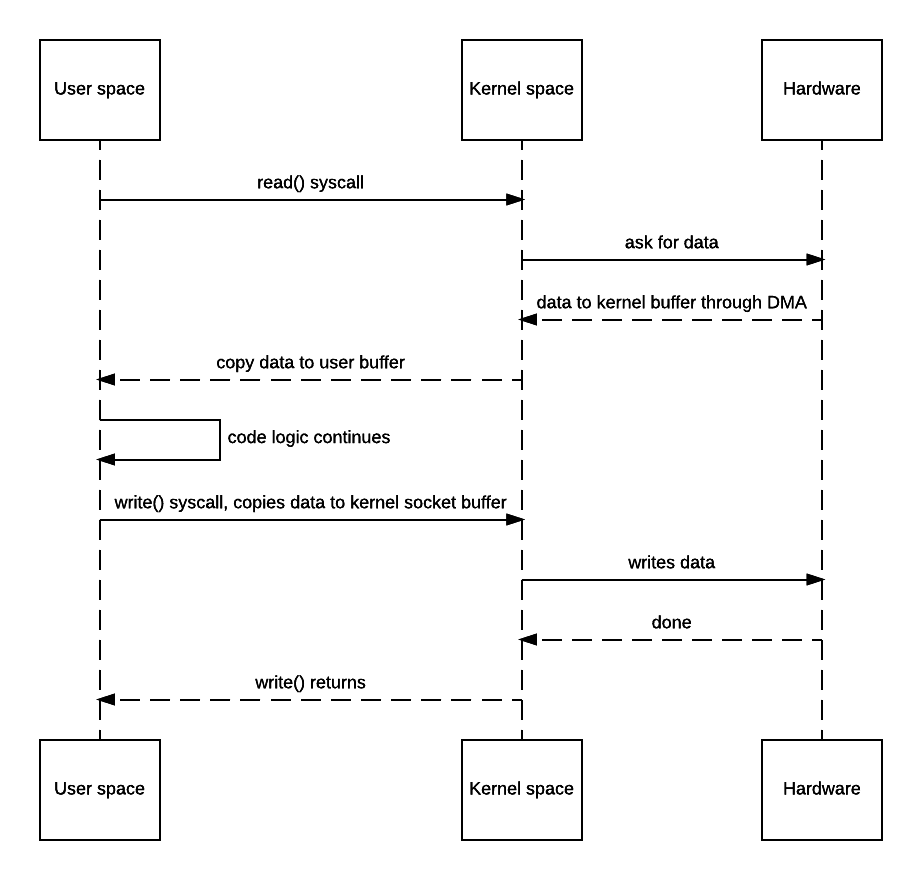

## 零拷贝
### 通常情况
如下图：

1. JVM调用read()方法
2. 操作系统切换至内核模式，内核空间从硬件读取数据至内核空间
3. 操作系统内核空间将数据拷贝至用户缓冲区，操作系统切换至用户态，read()方法结束返回数据
4. JVM进程执行代码逻辑并在业务逻辑结束后发送write()系统调用
5. 操作系统切换至内核态，将数据从用户缓冲区拷贝至输出缓冲区
6. 数据写回到硬件,操作系统返回用户态继续执行后续逻辑代码

** 如果不强调性能上述方式不会有什么问题，但是如果比较关注底层性能，上述方式就会存在一些性能瓶颈，因为
上述过程设计四次操作系统上下文切换，两次非必要内存拷贝 **

### zero-copy

基于操作系统实现
1. 发送sendFile()系统调用请求硬件资源
2. 读取硬盘数据
3. 写入缓存
4. 写数据至硬盘
5. 返回结果
